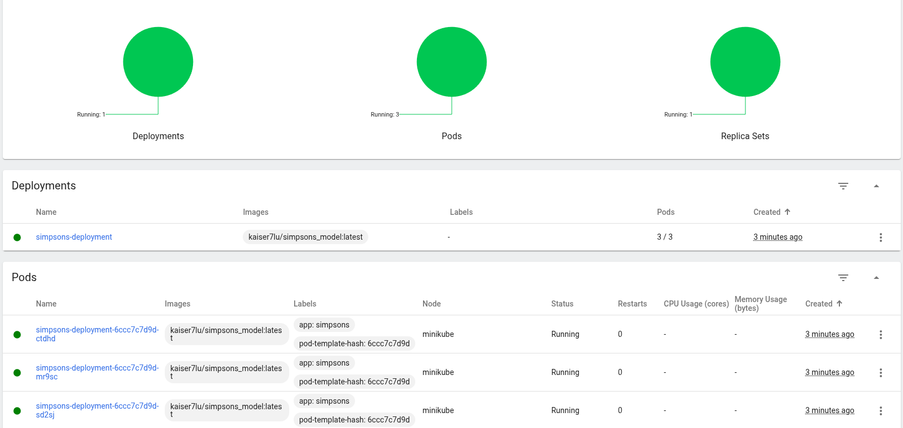
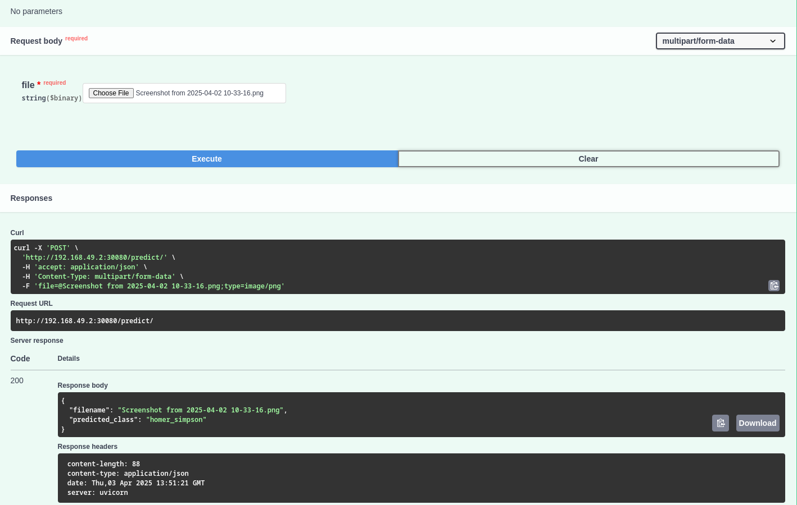

<div style="font-size: 48px; font-weight: bold;">HW-1 : KUBERNETES</div>

# СТАРТУЕМ
```bash
kaiser@fedora ~/w/r/p/d/kuber (main)> minikube start --driver=docker                                                         (base) 
😄  minikube v1.35.0 on Fedora 40
✨  Using the docker driver based on existing profile
👍  Starting "minikube" primary control-plane node in "minikube" cluster
🚜  Pulling base image v0.0.46 ...
🔄  Restarting existing docker container for "minikube" ...
🐳  Preparing Kubernetes v1.32.0 on Docker 27.4.1 ...
🔎  Verifying Kubernetes components...
    ▪ Using image docker.io/kubernetesui/dashboard:v2.7.0
    ▪ Using image docker.io/kubernetesui/metrics-scraper:v1.0.8
    ▪ Using image gcr.io/k8s-minikube/storage-provisioner:v5
💡  Some dashboard features require the metrics-server addon. To enable all features please run:

        minikube addons enable metrics-server

🌟  Enabled addons: storage-provisioner, dashboard, default-storageclass
🏄  Done! kubectl is now configured to use "minikube" cluster and "default" namespace by default
```

# Добавляем Deployment
```bash
kaiser@fedora ~/w/r/p/d/kuber (main)> kubectl apply -f deployment.yaml                                                       (base) 
deployment.apps/simpsons-deployment created
kaiser@fedora ~/w/r/p/d/kuber (main)> kubectl get pods                                                                       (base) 
NAME                                   READY   STATUS              RESTARTS   AGE
simpsons-deployment-6ccc7c7d9d-pmxkq   0/1     ContainerCreating   0          35s
simpsons-deployment-6ccc7c7d9d-qp7dz   0/1     ContainerCreating   0          35s
simpsons-deployment-6ccc7c7d9d-xtcv8   0/1     ContainerCreating   0          35s
```
Смотреть что не так с подом через describe pod ... -n ./. (namespace)

```bash
Events:
  Type     Reason                           Age    From               Message
  ----     ------                           ----   ----               -------
  Normal   Scheduled                        9m48s  default-scheduler  Successfully assigned default/simpsons-deployment-6ccc7c7d9d-pmxkq to minikube
  Warning  FailedToRetrieveImagePullSecret  9m47s  kubelet            Unable to retrieve some image pull secrets (regcred); attempting to pull the image may not succeed.
  Normal   Pulling                          9m47s  kubelet            Pulling image "kaiser7lu/simpsons_model:latest"
```
# Обзор ошибок
Сначала просто не так были прописаны креды :) 

Креды прописывать 
```bash
kubectl create secret docker-registry regcred \
--docker-server=https://index.docker.io/v1/ \
--docker-username= \
--docker-password= \
--docker-email= 
```

Безопасный вариант:

```bash
read -p "Docker Username: " DOCKER_USERNAME
read -p "Docker Email: " DOCKER_EMAIL
read -s -p "Docker Password: " DOCKER_PASSWORD
echo

kubectl create secret docker-registry regcred \
  --docker-server=https://index.docker.io/v1/ \
  --docker-username="$DOCKER_USERNAME" \
  --docker-password="$DOCKER_PASSWORD" \
  --docker-email="$DOCKER_EMAIL" \
  -n your-namespace
```
Проверить, что точно все добавилось: 
`kubectl add secrets`

После фикса проблема не исчезла, однаок после внимательного рассмотрения Dockerfile выяснилось, что просто не запускался сервер и контейнер самоуничтожался. Поэтому пришлось переделать образ

удаляем поды при помощи `kubectl delete deployment simpsons-deployment`

В minikibe dashboard:


В консольке
```
kaiser@fedora ~/w/r/p/d/kuber (main) [1]> kubectl get pods                                                     (base) 
NAME                                   READY   STATUS    RESTARTS   AGE
simpsons-deployment-6ccc7c7d9d-ctdhd   1/1     Running   0          7m15s
simpsons-deployment-6ccc7c7d9d-mr9sc   1/1     Running   0          7m15s
simpsons-deployment-6ccc7c7d9d-sd2sj   1/1     Running   0          7m15s
```
Добавляем сервис:

`kubectl apply -f service.yaml`
Смотрим сервисы через `kubectl get service`
```bash
NAME               TYPE        CLUSTER-IP      EXTERNAL-IP   PORT(S)        AGE
kubernetes         ClusterIP   10.96.0.1       <none>        443/TCP        29d
simpsons-service   NodePort    10.103.249.33   <none>        80:30756/TCP   20m
```
Так как не был указан NodePort, он был выдан случайно. Зафиксируем его и перезапустим:
```bash
kaiser@fedora ~/w/r/p/d/kuber (main)> kubectl delete service simpsons-service                                  (base) 
service "simpsons-service" deleted
kaiser@fedora ~/w/r/p/d/kuber (main)> kubectl apply -f service.yaml                                            (base) 
service/simpsons-service created 
```

# Демонстрация работы модели
Доступ к серверу через `http:"minikube ip":30080`

Я использую swagger api для простоты



Завершаем работу : `minikube stop`

```bash
✋  Stopping node "minikube"  ...
🛑  Powering off "minikube" via SSH ...
🛑  1 node stopped.
```

Или `minikube delete`, чтобы вообще удалить кластер

